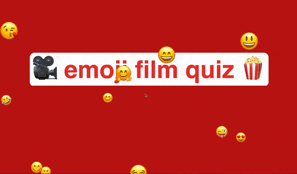

# emoji-quiz

Team based movie quiz game where each team try to guess the movie title fastest
one emoji at a time.

Try it out at https://emoji-quiz.surge.sh/ (Tested on Mac)

Pres any key to begin, and use the following keys to operate the game:

* SPACE - Show next emoji clue
* p - Go to next puzzle
* ENTER - Show answer
* 1 - Team 1 wins the puzzle
* 3 - Team 2 wins the puzzle
* q - Increase the score for team 1 (useful to correct scores)
* a - Decrease the score for team 1 (useful to correct scores)
* e - Increase the score for team 2 (useful to correct scores)
* d - Decrease the score for team 2 (useful to correct scores)
* BACKSPACE - Play a sound for an incorrect answer

# Demo

